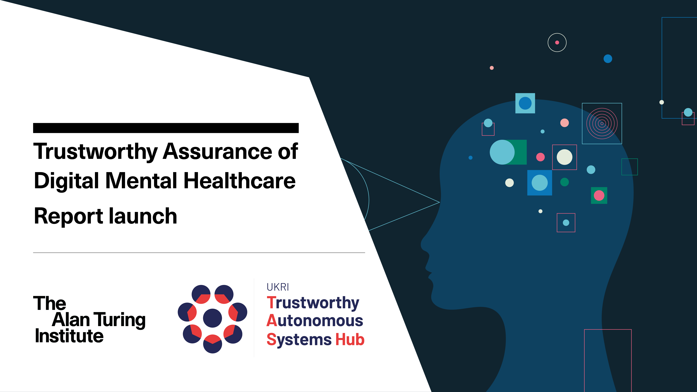

# Trustworthy Assurance

| Information | Links |
| :--- | :--- |
| **Read Online** | [][ta-website]|
| **Download Trustworthy Assurance of Digital Mental Healthcare Report** | [Download PDF](https://zenodo.org/record/7107200/files/final-report.pdf?download=1) |
| **Cite Trustworthy Assurance of Digital Mental Healthcare Report** | Burr, C. and Powell, R., (2022) Trustworthy Assurance of Digital Mental Healthcare. *The Alan Turing Institute*. [https://doi.org/10.5281/zenodo.7107200](https://doi.org/10.5281/zenodo.7107200) |
| **Repository License** | [![CC BY 4.0][cc-by-shield]][cc-by] |

Welcome to the GitHub repository for the Trustworthy Assurance Website.
This repository is used to host content and resources for [our website][ta-website], which includes reports, graphics, tools, and other resources.

This work is licensed under a
[Creative Commons Attribution Share Alike 4.0 International][cc-by].

[![CC BY 4.0][cc-by-image]][cc-by]

[cc-by]: https://creativecommons.org/licenses/by-sa/4.0/
[cc-by-image]: https://licensebuttons.net/l/by-sa/4.0/88x31.png
[cc-by-shield]: https://img.shields.io/badge/License-CC--BY--SA--4.0-blue
[ta-website]: https://alan-turing-institute.github.io/trustworthy-assurance
