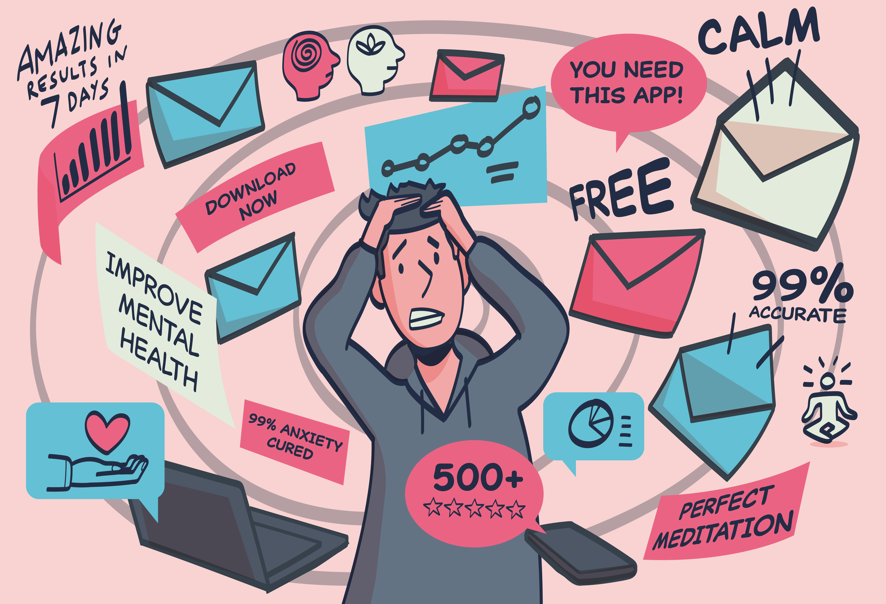

---
authors:
  - Rosamund Powell
tags:
  - university
  - duty-of-care
  - students
  - higher-education
---
# Applying Trustworthy Assurance—Digital Mental Healthcare at UK Universities

> **Chapter Overview**
>
> This section is the first of two sections that present findings from research conducted with stakeholders and/or affected users. Specifically, this section presents findings from research conducted on the application of trustworthy assurance to the procurement of digital mental health technologies for use in the higher education (HE) sector. 
>
> First, we provide an overview of the digital mental healthcare landscape at UK universities, detailing the pressures faced by university teams and the range of services currently on offer across the country.  
>
> Second, we present findings from a series of participatory engagements conducted with students and administrators at universities across the UK. We outline a series of contextual challenges to the ethical deployment of digital mental healthcare in higher education before exploring how the methodology of trustworthy assurance might be introduced in this sector to help tackle these challenges. For each challenge identified, future recommendations for the sector are provided. 
>
> Broader lessons for the ethics of digital mental healthcare are also fed forward into Chapter 4 where further recommendations for policymakers and developers are given.

## The University Context

Prior to the onset of the Covid-19 pandemic, the suggestion that student mental health was in crisis across UK universities was already prominent.[^1] Media attention intensified around 2017, for instance, in response to a cluster of high-profile suicides.[^2] Since then, concern has only grown further, and focus has turned to whether the crisis has worsened due to the increased social isolation brought about by Covid-19 and remote learning.[^3]  

[^1]: (https://www.theguardian.com/society/2019/sep/27/anxiety-mental-breakdowns-depression-uk-students )
[^2]: (https://journals.sagepub.com/doi/full/10.1177/02610183211024820)
[^3]: (https://www.timeshighereducation.com/news/uk-student-mental-health-crisis-may-be-worse-thought  , https://www.if.org.uk/2021/03/11/new-ons-data-show-student-mental-health-crisis/)

While media reports have been criticised for their simplistic focus on suicide figures as a metric for student wellbeing, research by The Office for Students has found that lengthy waiting times for counselling and a rise in help-seeking behaviour have both put an increased strain on services. All this has occurred during a period where the overall student population has grown.[^4]

[^4]: (https://www.officeforstudents.org.uk/media/b3e6669e-5337-4caa-9553-049b3e8e7803/insight-brief-mental-health-are-all-students-being-properly-supported.pdf , https://www.thelancet.com/journals/lanpsy/article/PIIS2215-0366(19)30275-5/fulltext)

Research continues to point to significant challenges facing university mental health services given factors such as the fivefold increase in students disclosing mental health conditions between 2007 and 2017[^5] and the lack of capacity to address student concerns quickly. For instance, NUS research found that only one in six students received professional support within one week of reaching out.[^6]   

[^5]: (https://www.bmj.com/content/361/bmj.k2608.long)
[^6]: (https://nusdigital.s3-eu-west-1.amazonaws.com/document/documents/33436/59301ace47d6320274509b83e1bea53e/NUSUSI_Student_Wellbeing_Research_Report.pdf)

In this high-pressure context, systemic changes have been proposed. Key policy documents, from the University Mental Health Charter to Universities UK Step Change Framework and IPPR’s report on student mental health, have all called for a “whole university approach”, for better cohesion between university departments, and for a greater focus on positive wellbeing. In addition to structural shifts, these recommendations have increasingly referenced ‘digital interventions’ as a key tool within the student mental health offering.[^7] 

Digital interventions are frequently seen as a “natural step” for student mental health services as they expand beyond the traditional counselling model,[^8] while youth mental health is seen as a prime target for AI with the NHS AI strategy noting their first task with regard to mental wellbeing “is to look into children and young people’s mental health” using AI-driven solutions.[^9]  

[^7]: (Step Change + Universities Mental Health Charter + IPPR Report ‘Not By Degrees')
[^8]: (https://www.officeforstudents.org.uk/advice-and-guidance/student-wellbeing-and-protection/student-mental-health/the-role-of-digital-mental-health-support-tools-and-the-importance-of-the-student-co-production-model-in-supporting-their-development/)
[^9]: (https://www.nhsx.nhs.uk/media/documents/NHSX_AI_report.pdf)

Amid these policy recommendations for modernisation, digital mental healthcare offerings designed for the general population have proliferated with The Office for Students suggesting 43,000 wellness and medical apps are now available for smartphone use.[^10]

It is no surprise, therefore, that these new tools have appealed to universities facing rising service demand alongside tight budgets, and that digital mental healthcare adoption has advanced at pace across UK universities. 
[^10]: (https://www.officeforstudents.org.uk/advice-and-guidance/student-wellbeing-and-protection/student-mental-health/the-role-of-digital-mental-health-support-tools-and-the-importance-of-the-student-co-production-model-in-supporting-their-development/)

One way in which the growth in digital mental healthcare has been amplified is through universities’ informal recommendations of external apps.[^11] For example, among the 24 Russel Group Universities in the UK, 15 recommend students try Headspace, eight point in the direction of Calm, and nine recommend SAM (Self-help App for the Mind), to name just a few of the apps listed on university webpages, typically under the heading of ‘self-help resources’.[^12]  

[^11]: (To do - add examples)
[^12]: (At times these recommendations for self-help apps are accompanied by a disclaimer. For example, the University of Durham notes that “the counselling service is happy to signpost this information/the availability of free access to these resources, in the hope they might prove useful to students and staff. However, please be aware that the Counselling Service does not have any relationship or affiliation with any of the providers, nor does it support, or endorse in any way the external information, advice, other services and/or resources that can be accessed via the links below (https://www.dur.ac.uk/counselling.service/self-help/). In other instances they are simply offered as resources for students to browse at their own discretion.)

Another way in which digital mental healthcare has infiltrated the university sector is through the formal procurement by universities of digital mental health tools designed with the specific needs of student populations in mind. Kotouza et al. have mapped these shifts and found that, as of 2021, “more than half of UK universities” have a contract with at least one from SilverCloud and Togetherall while “Fika won over 35 UK university contracts between 2019 and 2020”.[^13]  

[^13]: (https://journals.sagepub.com/doi/full/10.1177/02610183211024820)

This rapid adoption of digital mental health tools may be seen as a perfect solution for the university sector, especially when the claims made by these digital service providers are taken at face value. For example, Fika claims to “help you transform into a prevention culture of mental fitness”,[^14]  while Kooth describe their platform as a “safe and confidential space to share experiences and gain support”.[^15]  However, it is important that universities are given the tools required to assess these claims themselves, and to do so using systematic, reliable, and well-validated procedures and standards. The [University Mental Health Charter](https://www.studentminds.org.uk/uploads/3/7/8/4/3784584/191208_umhc_artwork.pdf), for instance, emphasises that the “need for quality assurance extends to other interventions, such as the provision of digitally based services”. Further guidance is currently required for universities to be able to carry out such quality assurance, and in particular for university teams to effectively assess these digital tools on the basis of their ethical implications. Here, we present findings to inform universities in doing such due diligence.
[^14]: (https://www.fika.community/about)
[^15]: (https://student.kooth.com)

## Workshop Information 

To assess current challenges to the ethical and trustworthy deployment of digital mental technologies in a university context, we ran a series of participatory engagements to seek the feedback of university students and mental health teams. 

The findings presented below are based upon a series of participatory engagement events conducted by The Alan Turing Institute between January and March 2022. These consisted of semi-structured interviews with university administrators leading mental health teams at 10 universities across the UK (henceforth ‘administrators’) alongside research workshops attended by 25 students enrolled in undergraduate and postgraduate courses at UK universities (henceforth ‘students’). 

*Table 2.1—summary information about the two sets out workshops.*
| Groups | Purpose of workshop | Type of Engagement | Main activities |
| --- | --- | --- | --- |
| `Administrators` | <ul><li> To identify which data-driven technologies or services are used by higher education institutions to support or deliver on their duty of care for students.</li> <li> To understand what metrics or properties are used to evaluate a data-driven technology or service prior to its procurement and deployment.</li> <li> To determine whether the administrators and students share the same goals and values when evaluating a service.</li> <li> To test the ethical assurance method and how it may be applied to specific case studies. </li></ul> | Semi-Structured Interviews | <ol><li> Exploring ethical principles and sharing current procurement approaches. <li> understanding duty of care. </li> <li> Assessing the trustworthy assurance methodology </li></ol> |
| `Students` | <ul><li> To explore a set of illustrative case studies that were designed to support the development of trustworthy assurance cases and identify significant ethical principles and values. </li> <li> To build trustworthy assurance cases using a prototype platform developed for this purpose </li> | Group Workshops | <ol><li> Which values and principles matter most to you? </li> <li> Evaluating case studies </li> </ol>|  

### Analysis and Contextual Challenges

Key findings from these engagements conducted with university administrators and students are presented as follows. First, we explore contextual challenges to the ethical deployment of digital mental health technologies at universities, as raised by students and administrators. Second, we present findings on how the implementation of trustworthy assurance to this sector may resolve challenges. In each case, distinct perspectives from administrators as compared to students will be highlighted and conclusions for the future of ethical digital mental healthcare procurement summarised.

As discussed in the [Introduction](#introduction), digital technologies raise a distinct set of ethical issues when deployed in a mental health context. For example, it is necessary to consider their impact on the therapeutic relationship and the privacy implications of using sensitive health data.[^16]  Many of these ethical issues continue to be relevant at UK universities. However, the challenges posed by emerging digital mental health tools are specific to the context in which they are deployed. Therefore, this sub-project set out to determine HE sector-specific challenges to the trustworthy and ethical procurement and assurance of digital mental health technologies. 

[^16]: (https://www.nuffieldbioethics.org/assets/pdfs/The-role-of-technology-in-mental-healthcare.pdf)

Contextual challenges, ranging from obstacles to transparency and accessibility to external pressures and institutional constraints, are summarised to inform key conclusions for the HE sector. 

#### Challenge 1: Duty of care: a legal or ethical goal?

To determine which digital technologies to procure and provide, universities must first have a clear understanding of the overarching goal of their service. Defining this top-level goal also constitutes the first stage in developing a trustworthy assurance case. 

In a university context, defining this overarching goal introduces its own set of challenges. Universities are understood to have a duty of care to their students’ mental health. This has been defined by AMOSSHE—the Association of Managers Of Student Services in Higher Education—as the duty of the institution to “to deliver its educational and pastoral services to the standard of the ordinarily competent institution, and, in carrying out its services and functions, to act reasonably to protect the health, safety and welfare of its students.”[^17] Therefore, as part of this sub-project we explored whether 'duty of care' could serve as a top-level normative goal for a trustworthy assurance case—going beyond the SAFE-D principles.

[^17]: https://www.amosshe.org.uk/futures-duty-of-care-2015

All digital technologies must support the university in delivering upon this duty. But, to assess whether a particular procurement choice is in-keeping with a university’s responsibility, more detail is needed to translate duty of care into a fully specified goal. 

For university administrators, our engagement found that legalistic understandings of duty of care were common as references to the avoidance of negligence and to ensuring institutional competence and compliance were frequent. This is unsurprising, and as one noted that, “if the worst outcome happens and you’re in a coroner’s court”, you must be able to show that due diligence has been done and procedure has been followed. Moreover, students also made frequent references to the importance of legal mechanisms in holding institutions to account.

> **Administrator Perspective**
> 
> “We take the duty of care very seriously. And I think it is not the easiest thing to articulate. We talk regularly with our legal team about duty of care. If we are writing documents which reference the duty of care, we always talk with them about that.”
> 
> **Student Perspective**
> 
> “In terms of duty of care, that brings in things like the equalities act and various educational laws and policies so that universities aren’t discriminating against students based on access or based on protected characteristics, and they are following all of the laws.” 

However, despite these legalistic framings, it is clear that the law does not provide a complete guide to action. AMOSSHE’s account on duty of care clarifies these challenges, noting first that “student law is still evolving”, thus creating “difficulty in providing a legal definition of an institution’s duty of care”, and second, that “there is a balance between what the university should do as a legal minimum and what they could do based on a university’s perceived moral obligation”.[^18] These uncertainties can cause confusion for administrators.
[^18]: https://www.amosshe.org.uk/futures-duty-of-care-2015

> **Administrator Perspective**
> 
> “I think again it is such a problematic area for higher education institutions. I’m not sure there is any clarity within the sector about that duty of care.”

Ambiguities with regard to the nature and scope of a university’s duty of care can be observed when universities must balance tensions between the preservation of student autonomy and the management of risk through forced intervention. Administrators raise the difficulty of these decisions on whether to intervene, illustrating uncertainty around duty of care. 

> **Administrator Perspective**
> 
> “They are 18, they are adults. If they don’t want our interventions, there is very little we can do. So, for us, it is balancing that fine line all the time”
>
> “I think we are at a very interesting period of somebody’s life. The complications are, obviously, over-18 somebody will be in 99.9% of cases an adult. So, understanding the duty of care you have to… people as children or minors is very different from this new stage. But there does seem to by some muddying of the waters with this and it comes up a lot.”

The everyday practices of a university mental health team must, therefore, go beyond the pursuit of compliance to grapple with ethical decisions on when specific interventions may or may not be appropriate. In short, legal understandings of duty of care must be supplemented by ethical values which guide the actions of teams in their selection of services. 

For administrators, the ethical values raised as key to duty of care include: ‘inclusivity’, ‘putting the student first’, ‘consent’, ‘avoiding negative impact on the institution’, ‘best interest of every student’, ‘evidence-based decisions’, ‘benefit to all student groups’ and ‘value for money’. For students, key ethical values raised include: ‘transparency’, ‘inclusivity’, ‘anonymity’, ‘autonomy’, ‘privacy’ and ‘trust’.

While these ethical goals do show significant overlap, it is also clear to administrators that perspective is crucial to defining duty of care. First, different stakeholders define the goal of student mental health services differently. Second, perspectives on duty of care have shifted over time. Finally, the very introduction of digital services can influence who is seen to take responsibility for mental ill-health and so have an impact on how duty of care is understood.

> **Administrator Perspective**
> 
> “Parents think we’ve got more responsibility than I think. Probably students sometimes think we’ve got less responsibility”
> 
> “I think we are heading towards in loco parentis. Towards having that responsibility that schools have. I think that’s where the regulation is heading, if you look at things like the Student Mental Health Charter. All of the things are pushing us more and more that way.”
> 
> **Student Perspective**
> 
> “Digitisation of mental health services may further the idea that mental health is an individual’s issue and responsibility, rather than addressing the collective mental health and structural causal issues around wellbeing.”

Continued work is needed in order to understand if and how duty of care can be translated into a fully specified goal for a university mental health team and how this goal can inform specific actions during the procurement of digital mental health technologies. A participatory approach, considering the views of all impacted stakeholders, will be essential to clarifying the nature and scope of this responsibility.

| Conclusions and Recommendations | 
| -------- | 
| Universities should reflect on their duty of care in both legal and ethical terms. | 
| Shifting understandings and perspectival differences mean that a participatory approach to defining a top-level goal is crucial. |

#### Challenge 2: Organisational constraints: defining roles and responsibilities

Ambiguities surrounding the relative roles and responsibilities of different teams and institutions to protect student mental health have also at times hampered effective decision-making with regard to digital mental health. Descriptions of the decision-making rationale provided by administrators suggest a procurement process which is reactive rather than proactive, with a tendency to stick to the status quo or shift tack dramatically during a crisis.

> **Administrator Perspective**
> 
> 	“There was a general panic early March of "oh my god, what is going to happen?"”
> 
> “Quick leaps. It wasn’t particularly an evolution. We’d been considering it [Togetherall] ourselves for a couple of years so it was on the horizon but that [the pandemic] was the thing that really pushed us to do that”
> 
> “With TogetherAll, a lot of universities have been offering it a long time, and there was a clinical trial, but anecdotally when you go on the mail base and talk to other heads of services and ask if their students are using it, they find students just aren’t really using it. That’s what we find. Paying a lot of money and people aren’t using it. But they don’t want to look bad or roll it back.”

Reactive decisions are in part a consequence of the lack of clarity surrounding who is responsible for decisions on the procurement of digital mental health tools. First, there are significant ambiguities surrounding the relationship between university mental health services and the NHS. During engagements, administrators revealed that responsibility for procurement of digital services such as Togetherall resided in most instances with the university, but in certain cases with the NHS. In particular, administrators suggested that at times of crisis, where one institution was struggling to cope, the other had stepped in to fill a gap through purchasing a digital service. This dual responsibility can result in inconsistencies in who takes procurement decisions and in the long run could create a vacuum of responsibility if it is unclear where leadership lies. 

> **Administrator Perspective**
> 
> “That is the million-dollar question of where our services stop and the NHS starts and the piece around filling that gap because there is definitely a gap between.”

In addition, within the university, shifts towards a ‘whole university approach’ have occurred and were described by administrators. However, while greater involvement of departments such as financial services, accommodation, and examinations is taking place, less thought has been given to where responsibility for digital solutions may lie within this matrix and what capacity building is needed to develop the technical skills required to review digital technologies, monitor student use, and horizon scan for new directions. While procurement processes at many universities remain thorough in many respects, this results at times in decisions taken by clinical or legal teams, without dedicated attention to technical and ethical questions. In describing their procurement teams’ top priorities when reviewing digital technologies, administrators raised both clinical evidence and value for money. Other concerns specific to data-driven technologies and their ethical implications did not feature as prominently, indicating potential gaps in data literacy. 

> **Administrator Perspective**
> 
> “When I pull them [mental health team] in to look at new apps and things, what you find is they are trained practitioners, they are counsellors, but their digital skills are not up there."
>  
> “I remember BigWhiteWall came around and did a slick presentation and then it was around the table who thinks this is a good idea. Rights, yeah, let's go for it.”

Finally, as roles and responsibilities are clarified, a clear space for student involvement must be carved out. This was a priority raised by both students and administrators during engagements, but practical challenges must be addressed to involve all students and resolve possible tensions between student perspectives and clinical evidence. Additional challenges to student involvement in the procurement of digital technologies, such as the high entry costs sometimes associated with the evaluation of AI-driven tools, must also be addressed through education and collaboration between students and experts.

> **Administrator Perspective**
> 
> “Universities like to claim they are giving the students what they want but a lot of the time they are not really consulting students. We often have to convince HR and other systems to talk to students”
> 
> “Universities are often torn between do I go with the student voice or hard research. I will tell you which one they go with, student voice. The student voice doesn’t have to be many, they just have to be loud. We are not talking about thousands of students having an impact, we are talking about vocal students or the students union”
> 
> **Student Perspective**
> 
> “Creating dedicated spaces for students to voice their ideas and needs combined with evidence that these were somewhat taken on board. Utilising relationships with students and personal tutors/student support. Strong links with student societies and other student intermediaries.”
> 
> “Students need to be involved from the initial stages, so as to undercut serious biases working their way into the system. Furthermore, the biases within university cohorts should be examined – university intake of working class and state school students, POC, etc. is often not representative of the wider population, and technologies must make sure they are accessible to them as well, so that they are lasting into the future”. 

| Conclusions and Recommendations | 
| -------- | 
| Greater clarity is needed on the relative responsibilities of the NHS and university teams during the procurement of digital mental health technologies. |
| While university teams evolve to focus on greater integration and interdepartmental cooperation, greater attention must be paid to assigning responsibility for digital offerings and ensuring technical skills have been developed. |
| Engagements with administrators suggest that compliance with data protection laws is well established while there remains a gap in organisational readiness with regard to other methods for reviewing algorithmic techniques. Cross-domain communication may be essential for these review processes, potentially including IT and research departments. Consequently, designating responsibility for digital technologies should be considered as part of the shift to a ’whole university approach’. |
| Clarity on roles and responsibilities can also help designate responsibility for horizon scanning and proactive research rather than reactive decision-making. |
| Meaningful student involvement is necessary and capacity building may be needed to help them contribute meaningfully on technical topics.| 

#### Challenge 3: External Pressures

Greater clarity on responsibility for digital technologies within university mental health teams will only go part of the way to resolving current challenges. Significant pressures placed on mental health teams are outside of their control. In particular, concerns were raised throughout interviews and workshops surrounding the potential privatisation of student mental health.

> **Administrator Perspective**
> 
> “While we are higher education institutions, we are businesses, and there is a conflict of interest with a business decision versus a clinically-driven, sound-evidence decision about what works and what doesn’t.”
> 
> **Student Perspective**
> 
> “For-profits don’t tend to do things out of the kindness of their own hearts. So how much are universities paying for this? Will the students have to pay? Will it be full of ads? Where is the profit coming from?” 

The relationships between universities and developers do suggest for-profit companies are having a significant influence on the procurement of digital mental health technologies. The constant flood of digital offerings creates an environment where mental health teams struggle to ensure services are driven by student demand. Additionally, the nature of pitches received from developers often makes it impossible to evaluate services on the basis of evidence. Finally, the volume of products on the market has led to a dichotomy whereby administrators either spend significant time filtering through proposals or ignore them altogether. 

> **Administrator Perspective**
> 
> “What I tend to get is lots of emails offering me a magic wand.”
> 
> “These apps are coming at you from every direction, and I must get at least three emails a week.”
> 
> “They [providers] are not telling me what I need to know.” 
> 
> “I am absolutely inundated with emails every day from providers of these things and I just ignore them.”

These pressures which prevent services from being driven by student need are not only coming from private sector developers but from within the university sector itself. First, pressures from within an institution can lead to the adoption of a digital service on the basis of reputational concerns. Second, network pressures from comparisons with other universities can drive groupthink with regard to digital mental health tools. 

> **Administrator Perspective**
> 
> “I think it is about defensive practice as well. We just reviewed before the pandemic, we renewed BigWhiteWall, and I was quite keen to ditch and shift and look at alternatives. My boss at the time said I think we need to stay with it because it is a defensive action. If we get an FOI, it’s good to say all students get offered this. It’s worth 15k was the line I got, don’t care whether it works or not.”
> 
> “If you want to question decisions, you’re told ‘all these other Russell Group universities are offering BigWhiteWall or free subscriptions to X, Y, X’ so it seems that decisions are made more out of panic or what other institutions are doing because we need to look just as good.” 

| Conclusions and Recommendations | 
| -------- | 
| Universities must work together to leverage collective influence on developers such that developers provide them with more detailed information on the ethical implications of new technologies. The Trustworthy Assurance methodology provides one way of doing this (See [Methodological Challenges](#methodological-challenges)). |
| Networks such as AMOSSHE, the UK’s Student Services Organisation, can play an important role in stepping forward to provide evidence-based guidance on these topics and help to prevent decisions being taken on the basis of reputational comparison. |

#### Challenge 4: Algorithmic aversion: diverted resources and prioritising human services

In a university context, where resources are constrained and digital solutions have been described as offering value for money, it is unsurprising that fears have been raised over technologies replacing in-person services, despite this going against the desires of both administrators and students. Determining when digital solutions are not appropriate, desirable, or morally permissible, therefore, constitutes a key challenge for the higher education sector. Administrators note that despite their intention to supplement human services with digital, there have been times where more could be done to avoid the diversion of resources to digital technologies.

> **Student Perspective**
> 
> “We all know that universities are oversubscribed and when you are offered something like this, you feel as if you are at the bottom of the list, and your mental health and what you say is all part of criteria as to whether you are “bad enough” or “ill enough” for support. I think this is really damaging to someone’s mental health and can worsen their state of mind.”
>  
> **Administrator Perspective**
> 
> “What I never want is that we see digital services as an alternative to coming in and seeing our team” 
> 
> “We could probably be doing better to supplement and complement rather than replace”

Appeals to the importance of prioritising in-person services are significant. However, further specificity is required to determine how this can be achieved in a system where resources are constrained, and administrators inevitably face tough choices on where to direct funds. A more detailed understanding of students’ and administrators’ motivations for algorithmic aversion is necessary, therefore, to determine when and how digital technologies should be delivered. For administrators, concerns over clinical efficacy and the management of risks on platforms, as well as a lack of demand from students, formed the primary motivations for algorithmic aversion. In contrast, students focused on concerns around the dehumanisation of mental health, the lack of empathy offered by technology and the potential exacerbation of social isolation by digital offerings. Further research into these and further motivations for students’ and administrators’ algorithmic aversion is essential if student mental health services are to effectively deploy digital technologies.

> **Administrator Perspective**
> 
> “What we want to know is has it been evaluated, what’s the research that sits behind this and they [my team] have about zero tolerance of anything that just looks nice or doesn’t have that really robust background”
> 
> “Students don’t want more apps and more digital interventions. They want a small group of evidence-based digital interventions that focus on positive outcomes, and they want to see staff face-to-face.”
> 
> **Student Perspective**
> 
> “The dehumanisation of mental health. If students and staff come to see mental health as something solved by apps, the very complex nature of mental health can be undermined. We cannot automate mental health and wellbeing.”
> 
> “As someone who has gone to therapy and other support groups, it is very beneficial to do the work and even asking for help and seeking out support and turning up to someone in person is very nerve-wracking and that part of the process is so beneficial to mental health as it helps you face some anxieties” 
> 
> “There is a certain level of isolation and problematic self-sufficiency that could be encouraged by directing users towards certain technologies.”

Taking these motivations into account can help to reveal a more complex picture where students and administrators oppose digital technologies for specific reasons and in specific circumstances. This detail is necessary to guide administrators in choosing when and how to deploy digital technologies, and when to stick with in-person services. 

> **Administrator Perspective**
> 
> “I think there’s slight value around students that have got really low-level concerns. So, sleep, procrastination, and all those things. I think some services offer great self-diagnosis. And then of course around how to do some of those things which actually, yeah, there is probably a benefits of being able to do that on your phone in the warmth of your own flat or whatever, without having to come in and see one of my advisors who might tell you exactly the same thing. So those are the two areas I see it. I don’t ever want us to get to a point where we see it as a solution to replace the ability to come in and see somebody, particularly for more risky students or students that are struggling.” 

| Conclusions and Recommendations | 
| -------- | 
| In an environment where resources are constrained, careful consideration is needed over whether the decision to procure a technology is justified. Where resources are limited, justification of expenditure must go beyond claims that digital services do not replace in-person support to make transparent where funds come from and why the benefits of a digital service are seen to outweigh other options. |
| Administrators’ and students’ reasons for preferring in-person services appear to differ. Consultation of multiple student and staff groups is, therefore, essential to determining when and why digital solutions may be inappropriate.|

#### Challenge 5: Accessibility and fairness

In light of these varied motivations for aversion to digital solutions, it is clear that a more thorough understanding of different students’ needs is essential. During engagements, key concerns were raised surrounding accessibility and fairness in digital mental health, as many participants proposed a more tailored approach was needed. While increased accessibility of mental health services was described by both students and administrators as a primary advantage of digital technologies, a one size fits all approach has meant that access to effective care has not been improved for all groups. 

> **Administrator Perspective**
> 
> “There are certain student groups who would not like to go to one-to-one therapy where something online or an app or self-help, something more empowering that they can do in their own time. Something like that suits certain student groups. Broadly, with the little bits of research we have done, before the pandemic, it suits groups with social anxiety.”
> 
> “It is assumed all students want the same thing, so we are just going to give them big white wall. Even if it is not being supported in any other way. It is just assumed students will have the motivation to use this app. But not all students are appropriate for self-help. You find even outside of technology, not everyone is suited to CBT.” 
> 
> **Student Perspective**
> 
> “It [technology] can be more accessible, particularly for those with anxiety or mobility issues.”
> 
> “Providing accessible tools for ‘basic’ needs (e.g. productivity tools, which are not too concerning and can be widely used).”

These limitations of digital technologies’ ability to improve accessibility need not be a reason against their deployment. In some instances, the ability to reach different groups, such as those who feel the stigma of reaching out in person, can be seen as a positive. However, to ensure accessibility is prioritised across the student population, a greater awareness of who is (and who is not) served by digital technologies is required. During engagements, some administrators suggested males were engaged more with digital technologies, some pointed to females, others to differences in engagement across academic disciplines and finally some noticing no patterns of engagement at all. Further research into this is needed for universities to move away from a one-size-fits all approach and design solutions which explicitly address the needs of all student groups. 

> **Administrator Perspective**
> 
> “Actually, if there was more work involving different student groups and not assuming every student is a first-year middle class white academic undergraduate and there are other groups that can benefit as well, that’s where we can really learn.”

For students, concerns about fairness and health equity were significant. First, concerns were raised around digital poverty and the importance of challenging assumptions frequently made about student populations (e.g., that all students have easy access to technology). Second, students expressed worries about biases within these technologies and how algorithmic bias can impact their experiences. Both of these concerns were also raised during student discussions on the ethical issues which could arise on a peer-to-peer support platform (see Appendix Y, Case Studies). Here, students advocated for specific consideration of minority student groups with the possible designation of ‘safe spaces’ on such platforms based on protected characteristics or allowing students to actively choose who they were speaking to in order to avoid potential bullying or harassment. 

> **Student Perspective**
> 
> “Digital poverty is a thing. Just because you are at university, that doesn’t mean you have a smartphone, a laptop, or even a private space where you can access the platform” 
> 
> “I hate to be devil’s advocate, but I don’t think everybody has access to devices. I do get the point around accessibility, but I think companies or universities also need to be offering the support which will lead to them accessing these services and closing the digital poverty gap.”
> 
> “Information can be taken out of context and the cultural nuances with people from a range of backgrounds can be missed”

During discussions on the accessibility and fairness of digital technologies, proposals were made by students for accessibility to be understood in more subtle ways whereby digital solutions are not simply rolled out across the student population, but instead tailored to students with specific needs. It was also proposed that humans should mediate access to technology where possible so that a student can be matched with a service that helps them at the level they are ready for. Finally, empowerment of student choice was prioritised by participants in order to ensure students have control over the care they receive. 

| Conclusions and Recommendations | 
| -------- | 
| Greater integration with research departments is needed to ensure evidence is available on who is best served by specific mental health services. Universities can draw on their own research resources in order to take a deeper look at who is and is not benefiting from digital interventions. |
| Resource allocation within student services should take account of issues such as digital poverty, especially in light of the rise in remote learning following the pandemic.|
| Algorithmic bias is a pervasive issue beyond the mental health sector and one which administrators must be aware of so that thorough questions can be asked of service providers in advance of service roll out.[^bias] |
| A balance must be struck between empowering students to make their own choices without placing the burden of responsibility for mental health on them. |

[^bias]: There is a huge and varied literature on 'algorithmic bias', and so pinning down a single definition of the term is challenging. In other works we have instead focused on exploring three types of bias—social, statistical, and cognitive, which can impact the design, development, and deployment of ML and AI technologies. See [here](https://alan-turing-institute.github.io/turing-commons/rri/chapter2/understanding_bias/) for further information.

#### Challenge 6: Transparency and communication

Both students and administrators raised the importance of transparent and accessible communication about what services are available to students. Both groups also recognised that there is a lack of cut-through in current communication strategies leading to students being unaware of which services are on offer at their institutions. 

> **Administrator Perspective**
> 
> “Communications] can be quite difficult and especially around this sort of issue, around support. Through the pandemic, the availability of support has probably increased accessibility because a lot of it’s been online. And yet you still come across students who say, “there is no support, I don’t know where to find it”. And you kind of think, well there was a student newsletter, there’s all these social media posts across multiple channels, the student union that talked their language are talking about this stuff and TikTok is messaging about this, but still you haven’t picked it up? So, it is quite a challenging environment.”
>  
> **Student Perspective**
> 
> “I do not have adequate awareness of what is available”
> 
> “I think they should promote them more so I would actually know what is available”
> 
> “I know that I get it a lot at the bottom of an email or a newsletter that I don’t tend to read and I know that lots of people don’t read”

However, among students, the need for more awareness on what services are available was not the first priority regarding transparency and communication. Rather than focus simply on advertising services to students through multiple channels, students emphasised the importance of universities communicating the limitations and personal costs associated with these technologies to them, such as the loss of privacy or limited clinical efficacy. Such transparency is also emphasised as important to facilitating informed consent. 

> **Student Perspective**
> 
> “There is an asymmetry of knowledge as users don’t know/consent to their data being used for these purposes. The business model is not communicated to the user and is exploitative”
> 
> “All these policies will say things about sharing information or data with ‘trusted individuals’, ‘trusted organisations’, ‘trusted researchers’, but there is nothing about what makes these organisations trusted. And you can’t expect somebody in crisis to actually pour through all the terms and conditions.”

| Conclusions and Recommendations | 
| -------- | 
| To ensure students are aware of the services available, communications should be delivered by as many stakeholders as possible to include academic staff, student unions and student societies. These communications should also incorporate considerations around accessibility (e.g. alternative formats).|
| University mental health teams should be careful to communicate honestly with students about both benefits and risks of technologies, including transparency communications about efficacy and data sharing. |
| While in-depth and legally binding privacy policies are essential, an accessible breakdown of key information (for example through FAQs or video messages) are crucial to ‘informed’ consent. |

### Methodological Challenges

Overall, feedback from administrators and students suggests there is a long way to go to ensure responsible digital mental health innovation and procurement across the UK higher education sector. Progress can be made by following key recommendations set out here for universities. However, significant challenges will remain so long as changes only take place on the side of universities. Systemic changes from developers, policymakers, and university leadership teams are required to leverage the collective power required to foster a responsible innovation landscape.

The trustworthy assurance methodology provides one route through which such a culture of responsible innovation and transparent communication could be facilitated so that university stakeholders are given all necessary information to review new mental health tools offered to them. Due to the potential of this methodology in this sector we asked administrators to provide feedback on its deployment. Crucially, feedback indicated that this methodology would fit within current procurement practices, provide structure for the critical assessment of developers’ claims, and encourage more transparent communication among university staff about the rationale behind procurement decisions.

> **Administrator Perspective**
> 
> “My initial reaction is it's bloody brilliant. I’ve not seen anything like that and if something like that landed in my lap I would seize upon it.”
>  
> “What I’m looking for is a really quick way of working out whether this is something that’s worth looking at or not”
> “People like me are not naturally going to be flowchart kind of system development people. So, something like that [the assurance methodology], that can help us ask those questions and take these people through their paces, because what we get is very slick presentations, would be very helpful” 
> 
> “I think it would be really helpful to have a standard set of expectations that, you know… a standard expectation of having to demonstrate what they were trying to achieve.”
> 
> Nevertheless, several challenges to the effective deployment of trustworthy assurance, as raised by university administrators and students, must first be addressed. These are set out below in order to inform conclusions in Section 3 for the future of the assurance methodology.

#### Challenge 7: Interpreting assurance cases

Trustworthy assurance cases (as set out in Section 1) can appear complex. This introduces two key challenges for administrators tasked with assessing whether a particular assurance case meets their requirements for the procurement of a new digital mental health tool. 

First, technical skills are required to assess such cases and ensure evidence matches with property claims. Second, assurance cases cannot be treated in isolation and must often be evaluated alongside clinical standards. It is important to avoid treating clinical efficacy and ethical standards as equivalent. The assurance exercise is not intended to provide a universal stamp of approval that ethical concerns have been addressed. Instead, it will require contextual interpretation on whether the evidence provided by a developer is sufficient for deployment in a specific context. 

As a result, despite placing the greatest burden of responsibility on developers, this methodology does require administrators to have capacity to effectively review assurance cases. Policymakers must, therefore, take on responsibility for ensuring the necessary knowledge, capacity, and organisational readiness to assess digital technologies is provided to universities. This could be offered through consultation with national bodies such as AMOSSHE, The Office for Students or Universities UK or through dedicating resources to capacity building within each higher education institution.

#### Challenge 8: Uptake by developers

Obtaining necessary evidence and compiling it into an assurance case requires time and resources on the side of developers. A key obstacle to the deployment of trustworthy assurance therefore rests upon the motivation of developers to do this due diligence. Currently, such motivation will be minimal as standards across the sector place few demands on developers. 

Nevertheless, the collective purchasing power of universities across the UK is significant and can be leveraged in order to place further requirements on developers. This may be done through standards setting at the national level, for example through networks such as AMOSSHE. Additional pressures can also be placed on university networks by organisations such as the National Union of Students whose collective voice can influence procurement decisions. 

In setting high standards for developers, there must also be efforts not to exclude smaller mental health providers from having the resources to produce assurance cases. For this reason, the burden placed on developers may be reduced by sharing best practices or building repositories of publicly accessible assurance cases and argument patterns which can be used as a starting point for developers as they embark on the ethical reflection process.[^appendix1] 

[^appendix1]: See Appendix 1

#### Challenge 9: Use as a communication tool

Finally, in a university context, concerns were raised regarding the utility of trustworthy assurance in communicating to students that due diligence has been done and ethical risks have been considered. 

In conversation with the students, we discussed whether there was perceived value in administrators sharing assurance cases directly with the student body. Although there was no negative response, concerns were addressed about the complexity of assurance cases. Similar concerns were raised by administrators. In brief, stakeholders thought assurance cases represented too much information for effective communication, and that a summary would be preferable. Access to the full case could be made available for any students who were interested in order to facilitate both accessible communication and full transparency. 

