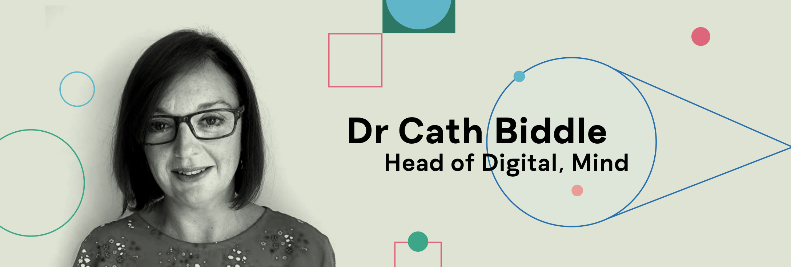

---
authors:
  - Cath Biddle
---
# Foreword

In a society where mental health need far outstrips the supply of services, it is perhaps inevitable that policy-makers and regulators, healthcare professionals and service providers, and employers and educators are looking for scalable solutions. At the same time as digital and data-driven technologies have become mainstream in so many areas of our lives, from banking to dating, people seeking support are also turning to the internet and app stores to find ways to get help. And commercial organisations haven’t been slow to spot this trend and provide solutions in exchange for your money or your data. For example, Calm and Headspace Health—both leading providers of mindfulness apps—were valued at $2bn and $3bn, and made an estimated $200m and $150m respectively in 2020 (https://www.businessofapps.com/data/).

In a fast moving and increasingly crowded marketplace, there is an urgent need to help those purchasing or procuring digital mental health services, for themselves or on behalf of others, to be confident that the products they are buying are not only safe and clinically effective, but also promote key ethical values, such as data protection, health equity and sustainability.  In other words, are *trustworthy*.

At Mind, we are actively exploring how to use digital technology to increase the reach and impact of all aspects of our work, from fundraising to campaigning and service delivery. While we recognise that digital mental health services can increase choice and reach, they are not a panacea and cannot replace the localised, personal touch that is core to our service.  [Our survey in 2021](https://www.mind.org.uk/about-us/our-policy-work/remote-mental-health-services/ or https://www.mind.org.uk/media/8575/mind-20582-trying-to-connect-report-aw2-welsh-recommendations-lr.pdf) of almost 2000 people revealed that more than one in three (35 per cent) found support from NHS mental health services, given over the phone or online, difficult to use; almost two in three (63 per cent) said they would have preferred to have been given face-to-face support; and one in four (23 per cent) say their mental health actually got worse as a result of using this support. However, two in three (69 per cent) appreciated not having to travel; almost one in two (47 per cent) were grateful for greater flexibility over appointment times; and two in five (40 per cent) said that waiting times were shorter. It is within this context that we are taking a test-and-learn approach to understand when and how digital mental health technologies can be used to augment and complement in person support.

As such, we welcome the work The Alan Turing Institute are doing to provide a framework to determine which digital mental health technologies are trustworthy.

Existing regulatory frameworks such as DTAC, NICE, MHRA, CQC exist, but do not provide sufficient coverage. Kooth, Togetherall and Silvercloud, for example, are all reputable, large companies delivering services to the NHS that fall outside the scope for CQC registration because the activities of those organisations are not deemed a ‘regulated activity’. Many healthcare apps also fall outside of the current definition of medical devices, and as such are outside of the scope of MHRA. And although NICE have recently updated their evidence standards framework for digital health technologies, it is not clear how evaluations will keep pace with the regularity of app updates.

This report raises questions that continue to concern providers of mental health support:

- Can digital healthcare provide a route to support people who are not already in contact or not well served by formal healthcare services?
- How can we ensure access to those who are digitally excluded or in data poverty, who may also be socially excluded and at increased risk of mental health challenges?
- Can structured scrutiny, as described/proposed in this report, encourage developers to improve the transparency and trustworthiness of their products?
- Are users (particularly at a time of increased vulnerability) adequately informed and protected by the practice of ‘opting in’ to terms and conditions which are often pages long and written for lawyers not end users?
- Can digital mental healthcare replace the ‘human connection’ or is it safest and most effective when used to supplement and complement in person support?

The research and trustworthy assurance framework proposed in this report by The Alan Turing Institute’s Public Policy Programme provides a key stepping stone towards addressing these questions, as we strive to meet the growing need for mental health support in a way that is both responsible and trustworthy.

**Dr Cath Biddle**

Head of Digital, Mind
